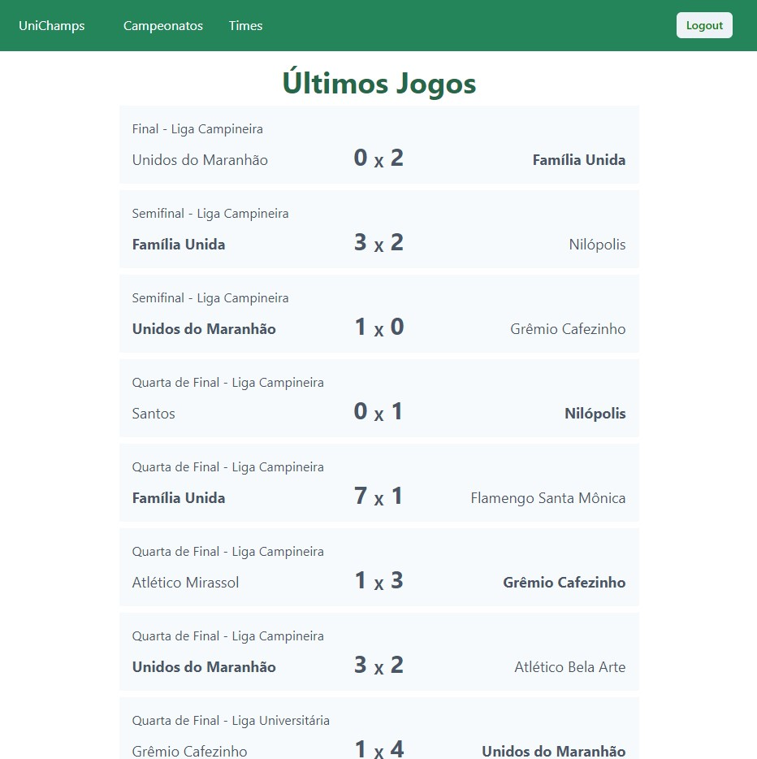
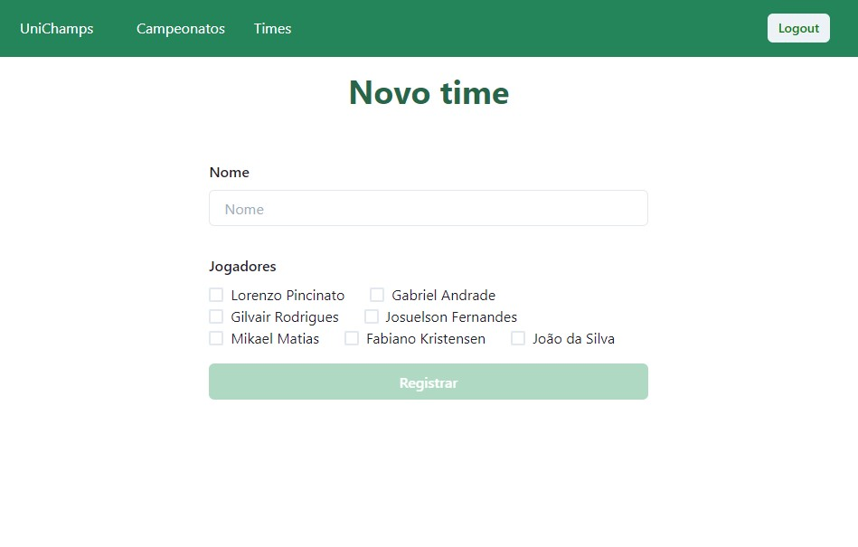
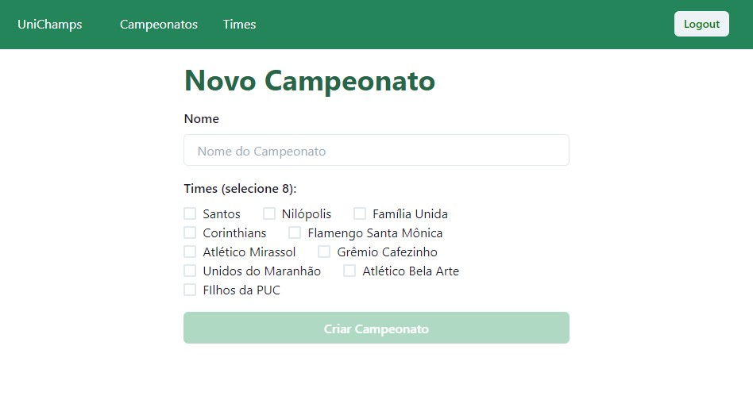

# ⚽ unichamps

Gerencie seus campeonatos de modo fácil e simples


## 🚀 Como executar o projeto

```bash

# Clone este repositório
$ git clone https://github.com/lorenzopincinato/unichamps.git

# Para rodar a API
# Acesse a pasta do projeto no terminal/cmd
$ cd unichamps/api

# Para rodar o App
# Acesse a pasta do projeto no terminal/cmd
$ cd unichamps/app

# Instale as dependências
$ yarn

# Execute a aplicação
$ yarn start

```


## Prints

* Últimos jogos



* Novo time



* Novo campeonato




## Status

🔚 Concluído


## Autores

- [Lorenzo Pincinato](https://github.com/lorenzopincinato)
- [Gabriel Andrade](https://github.com/gabriel-andrad3)
- [Gilvair Rodrigues](https://github.com/gilvair)
